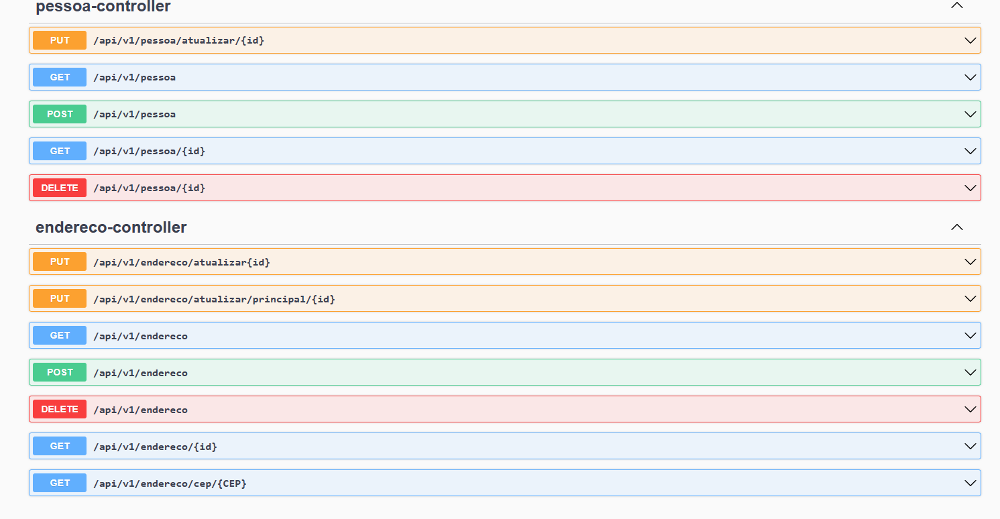

# People API

Essa aplicação cadastra pessoas e os seus endereços dando a possibilidade de salvar
qual será o endereço principal dessa pessoa cadastrada.

## Tecnologias Utilizadas

|  Ferramenta   |  Versão  |
|:-------------:|:--------:|
|  Spring Boot  |  3.0.2   |
| Java Zulu JDK |  17.0.5  |
| IntelliJ IDEA | 2022.3.2 |

## Como Ulitilizar o Repositorio Git

1. Clone o repositório:

~~~git
git clone https://github.com/samuelfilho-dev/api-pessoa
~~~
2. Entre na pasta do projeto:

~~~git
cd api-pessoa
~~~
3. Rode o comando para compilar o projeto:

~~~maven
./gradlew build
~~~
4. Rode o projeto:

~~~maven
./gradlew bootRun
~~~

## Como Usar a API

>**NOTA**
> 
> O Primeiro endereço que utilizador insere será considerado com endereço principal
> nessa aplicação
> 
> O Para Alterar o endereço o cliente devera alterar no path:
> `http://127.0.0.1:8080/api/v1/endereco/atualizar/principal/`
> 
> Passando o `id` como parâmetro 
> desta aplicação

 - Essa API utiliza Swagger como a sua documentação, logo para iteração
acesse:

   - `http://127.0.0.1:8080/swagger-ui/index.html#/`
   

 - Para Acesso No Banco De Dados:

    `http://127.0.0.1:8080/h2-console/`

    As credenciais padrão para o acesso do banco de dados são
   - `JDBC URL: jdbc:h2:mem:testdb`
   - `Username: root`
   - `Password: root`

- Imagem do Swagger na aplicação

- 

## Autor

<a href="https://www.linkedin.com/in/samuel-filho-981b2b196/">
 
  </a></a>

Feito Por Samuel Filho 👨‍💻📚

## Dúvidas

Entre em Contato Pelas minhas Redes Sociais.

